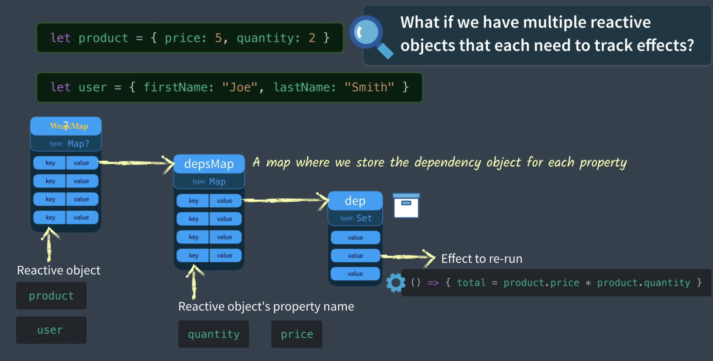

# 手写reactivity

[[toc]]

实现一个 reactivity

## basic

```js
let price = 5;
let quantity = 2;
let total = 0;

let dep = new Set();

let effect = () => {
  total = price * quantity;
};

function track() {
  dep.add(effect);
}

function trigger() {
  dep.forEach((effect) => effect());
}

track();
effect();
```

## depsMap

```js
const depsMap = new Map();
function track(key) {
  // Make sure this effect is being tracked.
  let dep = depsMap.get(key);
  if (!dep) {
    // There is no dep (effects) on this key yet
    depsMap.set(key, (dep = new Set())); // Create a new Set
  }

  dep.add(effect); // Add effect to dep
}
function trigger(key) {
  let dep = depsMap.get(key); // Get the dep (effects) associated with this key
  if (dep) {
    // If they exist
    dep.forEach((effect) => {
      // run them all
      effect();
    });
  }
}

let product = { price: 5, quantity: 2 };
let total = 0;

let effect = () => {
  total = product.price * product.quantity;
};

track('quantity');
effect();
// console.log(total)

product.quantity = 3
trigger('quantity')
// console.log(total)
```

## targetMap



```js
const targetMap = new WeakMap(); // targetMap stores the effects that each object should re-run when it's updated
function track(target, key) {
  // We need to make sure this effect is being tracked.
  let depsMap = targetMap.get(target); // Get the current depsMap for this target
  if (!depsMap) {
    // There is no map.
    targetMap.set(target, (depsMap = new Map())); // Create one
  }
  let dep = depsMap.get(key); // Get the current dependencies (effects) that need to be run when this is set
  if (!dep) {
    // There is no dependencies (effects)
    depsMap.set(key, (dep = new Set())); // Create a new Set
  }
  dep.add(effect); // Add effect to dependency map
}
function trigger(target, key) {
  const depsMap = targetMap.get(target); // Does this object have any properties that have dependencies (effects)
  if (!depsMap) {
    return;
  }
  let dep = depsMap.get(key); // If there are dependencies (effects) associated with this
  if (dep) {
    dep.forEach((effect) => {
      // run them all
      effect();
    });
  }
}
let product = { price: 5, quantity: 2 };
let total = 0;
let effect = () => {
  total = product.price * product.quantity;
};
track(product, 'quantity');
effect();
console.log(total)


product.quantity = 3
trigger(product, 'quantity')
console.log(total)
```

## Proxy and Reflect

```js
const targetMap = new WeakMap(); // targetMap stores the effects that each object should re-run when it's updated
function track(target, key) {
  // We need to make sure this effect is being tracked.
  let depsMap = targetMap.get(target); // Get the current depsMap for this target
  if (!depsMap) {
    // There is no map.
    targetMap.set(target, (depsMap = new Map())); // Create one
  }
  let dep = depsMap.get(key); // Get the current dependencies (effects) that need to be run when this is set
  if (!dep) {
    // There is no dependencies (effects)
    depsMap.set(key, (dep = new Set())); // Create a new Set
  }
  dep.add(effect); // Add effect to dependency map
}
function trigger(target, key) {
  const depsMap = targetMap.get(target); // Does this object have any properties that have dependencies (effects)
  if (!depsMap) {
    return;
  }
  let dep = depsMap.get(key); // If there are dependencies (effects) associated with this
  if (dep) {
    dep.forEach((effect) => {
      // run them all
      effect();
    });
  }
}

function reactive(target) {
  const handlers = {
    get(target, key, receiver) {
      let result = Reflect.get(target, key, receiver);
      track(target, key); // If this reactive property (target) is GET inside then track the effect to rerun on SET
      return result;
    },
    set(target, key, value, receiver) {
      let oldValue = target[key];
      let result = Reflect.set(target, key, value, receiver);
      if (result && oldValue != value) {
        trigger(target, key); // If this reactive property (target) has effects to rerun on SET, trigger them.
      }
      return result;
    },
  };
  return new Proxy(target, handlers);
}

let product = reactive({ price: 5, quantity: 2 });
let total = 0;

var effect = () => {
  total = product.price * product.quantity;
};
effect();

console.log('before updated quantity total = ' + total);
product.quantity = 3;
console.log('after updated quantity total = ' + total);
console.log('Updated quantity to = ' + product.quantity);
```

## activeEffect

```js
const targetMap = new WeakMap(); // targetMap stores the effects that each object should re-run when it's updated
let activeEffect = null; // The active effect running

function track(target, key) {
  if (activeEffect) {
    // <------ Check to see if we have an activeEffect
    // We need to make sure this effect is being tracked.
    let depsMap = targetMap.get(target); // Get the current depsMap for this target
    if (!depsMap) {
      // There is no map.
      targetMap.set(target, (depsMap = new Map())); // Create one
    }
    let dep = depsMap.get(key); // Get the current dependencies (effects) that need to be run when this is set
    if (!dep) {
      // There is no dependencies (effects)
      depsMap.set(key, (dep = new Set())); // Create a new Set
    }
    dep.add(activeEffect); // Add effect to dependency map
  }
}

function trigger(target, key) {
  const depsMap = targetMap.get(target); // Does this object have any properties that have dependencies (effects)
  if (!depsMap) {
    return;
  }
  let dep = depsMap.get(key); // If there are dependencies (effects) associated with this
  if (dep) {
    dep.forEach((effect) => {
      // run them all
      effect();
    });
  }
}

function reactive(target) {
  const handler = {
    get(target, key, receiver) {
      let result = Reflect.get(target, key, receiver);
      track(target, key); // If this reactive property (target) is GET inside then track the effect to rerun on SET
      return result;
    },
    set(target, key, value, receiver) {
      let oldValue = target[key];
      let result = Reflect.set(target, key, value, receiver);
      if (result && oldValue != value) {
        trigger(target, key); // If this reactive property (target) has effects to rerun on SET, trigger them.
      }
      return result;
    },
  };
  return new Proxy(target, handler);
}

function effect(eff) {
  activeEffect = eff;
  activeEffect();
  activeEffect = null;
}

let product = reactive({ price: 5, quantity: 2 });
let salePrice = 0;
let total = 0;

effect(() => {
  total = product.price * product.quantity;
});
effect(() => {
  salePrice = product.price * 0.9;
});

console.log(
  `Before updated quantity total (should be 10) = ${total} salePrice (should be 4.5) = ${salePrice}`
);
product.quantity = 3;
console.log(
  `After updated quantity total (should be 15) = ${total} salePrice (should be 4.5) = ${salePrice}`
);
product.price = 10;
console.log(
  `After updated price total (should be 30) = ${total} salePrice (should be 9) = ${salePrice}`
);
```

上面的例子如果做一下更改

```js
let product = reactive({ price: 5, quantity: 2 });
let salePrice = 0;
let total = 0;
effect(() => {
  total = salePrice * product.quantity;
});
effect(() => {
  salePrice = product.price * 0.9;
});
```

第一个 effect 的 salePrice 依赖第二个 effect 的 salePrice 时，由于 salePrice 不是响应式的，所以不起作用。可以使用 ref 将 salePrice 做成响应式的。

## ref

```js
const targetMap = new WeakMap(); // targetMap stores the effects that each object should re-run when it's updated
let activeEffect = null; // The active effect running

function track(target, key) {
  if (activeEffect) {
    // <------ Check to see if we have an activeEffect
    // We need to make sure this effect is being tracked.
    let depsMap = targetMap.get(target); // Get the current depsMap for this target
    if (!depsMap) {
      // There is no map.
      targetMap.set(target, (depsMap = new Map())); // Create one
    }
    let dep = depsMap.get(key); // Get the current dependencies (effects) that need to be run when this is set
    if (!dep) {
      // There is no dependencies (effects)
      depsMap.set(key, (dep = new Set())); // Create a new Set
    }
    dep.add(activeEffect); // Add effect to dependency map
  }
}

function trigger(target, key) {
  const depsMap = targetMap.get(target); // Does this object have any properties that have dependencies (effects)
  if (!depsMap) {
    return;
  }
  let dep = depsMap.get(key); // If there are dependencies (effects) associated with this
  if (dep) {
    dep.forEach((effect) => {
      // run them all
      effect();
    });
  }
}

function reactive(target) {
  const handler = {
    get(target, key, receiver) {
      let result = Reflect.get(target, key, receiver);
      track(target, key); // If this reactive property (target) is GET inside then track the effect to rerun on SET
      return result;
    },
    set(target, key, value, receiver) {
      let oldValue = target[key];
      let result = Reflect.set(target, key, value, receiver);
      if (result && oldValue != value) {
        trigger(target, key); // If this reactive property (target) has effects to rerun on SET, trigger them.
      }
      return result;
    },
  };
  return new Proxy(target, handler);
}

function ref(raw) {
  const r = {
    get value() {
      track(r, 'value');
      return raw;
    },
    set value(newVal) {
      raw = newVal;
      trigger(r, 'value');
    },
  };
  return r;
}

// function ref(intialValue) {
//   return reactive({ value: initialValue })
// }

function effect(eff) {
  activeEffect = eff;
  activeEffect();
  activeEffect = null;
}

let product = reactive({ price: 5, quantity: 2 });
let salePrice = ref(0);
let total = 0;

effect(() => {
  salePrice.value = product.price * 0.9;
});

effect(() => {
  total = salePrice.value * product.quantity;
});

console.log(
  `Before updated quantity total (should be 9) = ${total} salePrice (should be 4.5) = ${salePrice.value}`
);
product.quantity = 3;
console.log(
  `After updated quantity total (should be 13.5) = ${total} salePrice (should be 4.5) = ${salePrice.value}`
);
product.price = 10;
console.log(
  `After updated price total (should be 27) = ${total} salePrice (should be 9) = ${salePrice.value}`
);
```

## computed

```js
const targetMap = new WeakMap(); // targetMap stores the effects that each object should re-run when it's updated
let activeEffect = null; // The active effect running

function track(target, key) {
  if (activeEffect) {
    // <------ Check to see if we have an activeEffect
    // We need to make sure this effect is being tracked.
    let depsMap = targetMap.get(target); // Get the current depsMap for this target
    if (!depsMap) {
      // There is no map.
      targetMap.set(target, (depsMap = new Map())); // Create one
    }
    let dep = depsMap.get(key); // Get the current dependencies (effects) that need to be run when this is set
    if (!dep) {
      // There is no dependencies (effects)
      depsMap.set(key, (dep = new Set())); // Create a new Set
    }
    dep.add(activeEffect); // Add effect to dependency map
  }
}

function trigger(target, key) {
  const depsMap = targetMap.get(target); // Does this object have any properties that have dependencies (effects)
  if (!depsMap) {
    return;
  }
  let dep = depsMap.get(key); // If there are dependencies (effects) associated with this
  if (dep) {
    dep.forEach((eff) => {
      // run them all
      eff();
    });
  }
}

function reactive(target) {
  const handler = {
    get(target, key, receiver) {
      let result = Reflect.get(target, key, receiver);
      track(target, key); // If this reactive property (target) is GET inside then track the effect to rerun on SET
      return result;
    },
    set(target, key, value, receiver) {
      let oldValue = target[key];
      let result = Reflect.set(target, key, value, receiver);
      if (result && oldValue != value) {
        trigger(target, key); // If this reactive property (target) has effects to rerun on SET, trigger them.
      }
      return result;
    },
  };
  return new Proxy(target, handler);
}

function ref(raw) {
  const r = {
    get value() {
      track(r, 'value');
      return raw;
    },
    set value(newVal) {
      raw = newVal;
      trigger(r, 'value');
    },
  };
  return r;
}

function effect(eff) {
  activeEffect = eff;
  activeEffect();
  activeEffect = null;
}

function computed(getter) {
  let result = ref();

  effect(() => (result.value = getter()));

  return result;
}

let product = reactive({ price: 5, quantity: 2 });

let salePrice = computed(() => {
  return product.price * 0.9;
});

let total = computed(() => {
  return salePrice.value * product.quantity;
});

console.log(
  `Before updated quantity total (should be 9) = ${total.value} salePrice (should be 4.5) = ${salePrice.value}`
);
product.quantity = 3;
console.log(
  `After updated quantity total (should be 13.5) = ${total.value} salePrice (should be 4.5) = ${salePrice.value}`
);
product.price = 10;
console.log(
  `After updated price total (should be 27) = ${total.value} salePrice (should be 9) = ${salePrice.value}`
);

// Plus let's verify we can add additional objects to the reactive object

product.name = 'Shoes';

effect(() => {
  console.log(`Product name is now ${product.name}`);
});

product.name = 'Socks';
```
