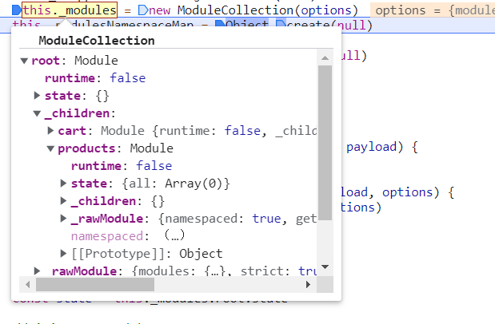

# vuex4 源码解读

[[toc]]

## 源码调试

### source-map

在 `examples/webpack.config.js` 中加 `source-map` 来调试源码。

```js
module.exports = {
  mode: 'development',
  devtool: 'source-map',
};
```

### @rollup/plugin-buble

将 ES6 代码编译成 ES5,可以将 `rollup.config.js` 中的 buble 注释掉生成 ES6 规范的代码。

```js
if (config.transpile !== false) {
  // c.plugins.push(buble())
}
```

或直接配置 transpile。

## 源码入口

```js
export default {
  version: '__VERSION__',
  Store,
  storeKey,
  createStore,
  useStore,
  mapState,
  mapMutations,
  mapGetters,
  mapActions,
  createNamespacedHelpers,
  createLogger,
};
```

导出 Store 和常用 API。

## store 对象

```js
class Store {
  constructor(options = {}) {
    if (__DEV__) {
      assert(
        // 当前环境是否支持 Promise
        typeof Promise !== 'undefined',
        `vuex requires a Promise polyfill in this browser.`
      );
      assert(
        // 是否是通过 new 操作符来创建 store 对象的
        this instanceof Store,
        `store must be called with the new operator.`
      );
    }

    const { plugins = [], strict = false, devtools } = options;

    // store internal state
    this._committing = false;
    this._actions = Object.create(null);
    this._actionSubscribers = [];
    this._mutations = Object.create(null);
    this._wrappedGetters = Object.create(null);
    this._modules = new ModuleCollection(options);
    this._modulesNamespaceMap = Object.create(null);
    this._subscribers = [];
    this._makeLocalGettersCache = Object.create(null);
    this._devtools = devtools;

    // bind commit and dispatch to self
    const store = this;
    const { dispatch, commit } = this;
    this.dispatch = function boundDispatch(type, payload) {
      return dispatch.call(store, type, payload);
    };
    this.commit = function boundCommit(type, payload, options) {
      return commit.call(store, type, payload, options);
    };

    // strict mode
    this.strict = strict;

    const state = this._modules.root.state;

    // init root module.
    // this also recursively registers all sub-modules
    // and collects all module getters inside this._wrappedGetters
    installModule(this, state, [], this._modules.root);

    // initialize the store state, which is responsible for the reactivity
    // (also registers _wrappedGetters as computed properties)
    resetStoreState(this, state);

    // apply plugins
    plugins.forEach((plugin) => plugin(this));
  }
}
```

### 判断环境

```js
if (__DEV__) {
  assert(
    // 当前环境是否支持 Promise
    typeof Promise !== 'undefined',
    `vuex requires a Promise polyfill in this browser.`
  );
  assert(
    // 是否是通过 new 操作符来创建 store 对象的
    this instanceof Store,
    `store must be called with the new operator.`
  );
}
// 报错信息处理
export function assert(condition, msg) {
  if (!condition) throw new Error(`[vuex] ${msg}`);
}
```

### 初始化变量

```js
// store internal state
this._committing = false;
this._actions = Object.create(null);
this._actionSubscribers = [];
this._mutations = Object.create(null);
this._wrappedGetters = Object.create(null);
// module收集器
this._modules = new ModuleCollection(options);
// 模块命名空间map
this._modulesNamespaceMap = Object.create(null);
this._subscribers = [];
this._makeLocalGettersCache = Object.create(null);
this._devtools = devtools;
```

### ModuleCollection

使用 register 方法递归 modules 生成 Module 树。

```js
export default class ModuleCollection {
  constructor(rawRootModule) {
    // register root module (Vuex.Store options)
    this.register([], rawRootModule, false);
  }

  get(path) {
    return path.reduce((module, key) => {
      return module.getChild(key);
    }, this.root);
  }

  getNamespace(path) {
    let module = this.root;
    return path.reduce((namespace, key) => {
      module = module.getChild(key);
      return namespace + (module.namespaced ? key + '/' : '');
    }, '');
  }

  update(rawRootModule) {
    update([], this.root, rawRootModule);
  }

  register(path, rawModule, runtime = true) {
    if (__DEV__) {
      assertRawModule(path, rawModule);
    }

    const newModule = new Module(rawModule, runtime);
    if (path.length === 0) {
      this.root = newModule;
    } else {
      const parent = this.get(path.slice(0, -1));
      parent.addChild(path[path.length - 1], newModule);
    }

    // register nested modules
    if (rawModule.modules) {
      forEachValue(rawModule.modules, (rawChildModule, key) => {
        this.register(path.concat(key), rawChildModule, runtime);
      });
    }
  }
  // ......
}
```



### Module

将 modules 组装成标准化的 Module 对象。

```js
export default class Module {
  constructor(rawModule, runtime) {
    this.runtime = runtime;
    // Store some children item
    this._children = Object.create(null);
    // Store the origin module object which passed by programmer
    this._rawModule = rawModule;
    const rawState = rawModule.state;

    // Store the origin module's state
    this.state = (typeof rawState === 'function' ? rawState() : rawState) || {};
  }

  get namespaced() {
    return !!this._rawModule.namespaced;
  }

  addChild(key, module) {
    this._children[key] = module;
  }

  removeChild(key) {
    delete this._children[key];
  }

  getChild(key) {
    return this._children[key];
  }

  hasChild(key) {
    return key in this._children;
  }

  update(rawModule) {
    this._rawModule.namespaced = rawModule.namespaced;
    if (rawModule.actions) {
      this._rawModule.actions = rawModule.actions;
    }
    if (rawModule.mutations) {
      this._rawModule.mutations = rawModule.mutations;
    }
    if (rawModule.getters) {
      this._rawModule.getters = rawModule.getters;
    }
  }

  forEachChild(fn) {
    forEachValue(this._children, fn);
  }

  forEachGetter(fn) {
    if (this._rawModule.getters) {
      forEachValue(this._rawModule.getters, fn);
    }
  }

  forEachAction(fn) {
    if (this._rawModule.actions) {
      forEachValue(this._rawModule.actions, fn);
    }
  }

  forEachMutation(fn) {
    if (this._rawModule.mutations) {
      forEachValue(this._rawModule.mutations, fn);
    }
  }
}
```

### installModule

installModule 的作用主要是为 module 加上 namespace 名字空间（如果有）后，注册 mutation、action 以及 收集所有 module 的 getter 到 `_wrappedGetters` 中去，同时递归安装所有子 module。

```js
export function installModule(store, rootState, path, module, hot) {
  const isRoot = !path.length;
  const namespace = store._modules.getNamespace(path);

  // register in namespace map
  if (module.namespaced) {
    if (store._modulesNamespaceMap[namespace] && __DEV__) {
      console.error(
        `[vuex] duplicate namespace ${namespace} for the namespaced module ${path.join(
          '/'
        )}`
      );
    }

    // 扁平化处理
    store._modulesNamespaceMap[namespace] = module;
  }

  // set state
  if (!isRoot && !hot) {
    // 获取父级的state
    const parentState = getNestedState(rootState, path.slice(0, -1));
    const moduleName = path[path.length - 1];
    store._withCommit(() => {
      if (__DEV__) {
        if (moduleName in parentState) {
          console.warn(
            `[vuex] state field "${moduleName}" was overridden by a module with the same name at "${path.join(
              '.'
            )}"`
          );
        }
      }
      parentState[moduleName] = module.state;
    });
  }

  const local = (module.context = makeLocalContext(store, namespace, path));

  // 遍历注册mutation
  module.forEachMutation((mutation, key) => {
    const namespacedType = namespace + key;
    registerMutation(store, namespacedType, mutation, local);
  });
  // 遍历注册action
  module.forEachAction((action, key) => {
    const type = action.root ? key : namespace + key;
    const handler = action.handler || action;
    registerAction(store, type, handler, local);
  });
  // 遍历注册getter
  module.forEachGetter((getter, key) => {
    const namespacedType = namespace + key;
    registerGetter(store, namespacedType, getter, local);
  });
  // 递归安装mudule
  module.forEachChild((child, key) => {
    installModule(store, rootState, path.concat(key), child, hot);
  });
}
```

### resetStoreState

初始化 store 中 state, 使用 reactive 使 state 成为响应式对象。vue3 的 reactive 是可以拿出来单独使用的。

```js
export function resetStoreState(store, state, hot) {
  const oldState = store._state;

  // bind store public getters
  store.getters = {};
  // reset local getters cache
  store._makeLocalGettersCache = Object.create(null);
  const wrappedGetters = store._wrappedGetters;
  const computedObj = {};
  forEachValue(wrappedGetters, (fn, key) => {
    // use computed to leverage its lazy-caching mechanism
    // direct inline function use will lead to closure preserving oldState.
    // using partial to return function with only arguments preserved in closure environment.
    computedObj[key] = partial(fn, store);
    Object.defineProperty(store.getters, key, {
      // TODO: use `computed` when it's possible. at the moment we can't due to
      // https://github.com/vuejs/vuex/pull/1883
      get: () => computedObj[key](),
      enumerable: true, // for local getters
    });
  });

  store._state = reactive({
    data: state,
  });

  // enable strict mode for new state
  if (store.strict) {
    enableStrictMode(store);
  }

  if (oldState) {
    if (hot) {
      // dispatch changes in all subscribed watchers
      // to force getter re-evaluation for hot reloading.
      store._withCommit(() => {
        oldState.data = null;
      });
    }
  }
}
```

### vue2 中 vuex 的响应式

在 vue2 的 vuex 中采用了 new 一个 Vue 对象来实现数据的响应式。

```js
store._vm = new Vue({
  data: {
    $$state: state,
  },
  computed,
});
```

## install

和 vue3 和 vue2 在实现 vuex 时，不了上面的响应式数据实现上有很大区别，在注入数据上也有很大区别。 vuex4 使用 provide / inject 和 全局的 $store 对象。vuex3 使用的是 Vue.mixin 在 beforeCreate 中注入。

### provide / inject


- 无论组件层次结构有多深，父组件都可以作为其所有子组件的依赖提供者。
- 默认情况下，provide/inject 绑定并不是响应式的。我们可以通过传递一个 ref property 或 reactive 对象给 provide 来改变这种行为。

### install 方法

```js
install (app, injectKey) {
  app.provide(injectKey || storeKey, this)
  app.config.globalProperties.$store = this
}
```

this 就是初始化好的 Store，那 useStore 是如何获取 store 的，使用 inject。

```js
function useStore(key = null) {
  return inject(key !== null ? key : storeKey);
}
```

### Vue.mixin

```js
// src/mixins.js
export default function (Vue) {
  const version = Number(Vue.version.split('.')[0]);

  if (version >= 2) {
    Vue.mixin({ beforeCreate: vuexInit });
  } else {
    // 兼容2之前的版本
    const _init = Vue.prototype._init;
    Vue.prototype._init = function (options = {}) {
      options.init = options.init ? [vuexInit].concat(options.init) : vuexInit;
      _init.call(this, options);
    };
  }

  function vuexInit() {
    const options = this.$options;
    // store injection
    if (options.store) {
      this.$store =
        typeof options.store === 'function' ? options.store() : options.store;
    } else if (options.parent && options.parent.$store) {
      this.$store = options.parent.$store;
    }
  }
}
```

通过组件的 beforeCreate 钩子注入 $store，在组件中直接使用 `this.$store`获取

## 工具方法

`store-util.js`的一些方法：

- genericSubscribe,
- getNestedState,
- installModule,
- resetStore,
- resetStoreState,
- unifyObjectStyle

上面已经用到几个，下面再介绍几个：

### enableStrictMode

只是一个对 state 修改的约束控制，控制 Vuex 执行严格模式，严格模式下，所有修改 state 的操作必须通过 mutation 实现，否则会抛出错误。

```js
function enableStrictMode(store) {
  watch(
    () => store._state.data,
    () => {
      if (__DEV__) {
        assert(
          store._committing,
          `do not mutate vuex store state outside mutation handlers.`
        );
      }
    },
    { deep: true, flush: 'sync' }
  );
}
```

其实在 commit,执行 mutation 是这样

```js
this._withCommit(() => {
  entry.forEach(function commitIterator(handler) {
    handler(payload);
  });
});

 _withCommit (fn) {
    const committing = this._committing
    this._committing = true
    fn()
    this._committing = committing
  }
```

### partial

仅仅是为了生成一个闭包环境

```js
export function partial(fn, arg) {
  return function () {
    return fn(arg);
  };
}
```

## store 中的一些 API

### commit

```js
commit (_type, _payload, _options) {
  // check object-style commit
  const {
    type,
    payload,
    options
  } = unifyObjectStyle(_type, _payload, _options)

  const mutation = { type, payload }
  const entry = this._mutations[type]
  if (!entry) {
    if (__DEV__) {
      console.error(`[vuex] unknown mutation type: ${type}`)
    }
    return
  }
  this._withCommit(() => {
    entry.forEach(function commitIterator (handler) {
      handler(payload)
    })
  })

  this._subscribers
    .slice() // shallow copy to prevent iterator invalidation if subscriber synchronously calls unsubscribe
    .forEach(sub => sub(mutation, this.state))

  if (
    __DEV__ &&
    options && options.silent
  ) {
    console.warn(
      `[vuex] mutation type: ${type}. Silent option has been removed. ` +
      'Use the filter functionality in the vue-devtools'
    )
  }
}
```

### dispatch

```js
dispatch (_type, _payload) {
  // check object-style dispatch
  const {
    type,
    payload
  } = unifyObjectStyle(_type, _payload)

  const action = { type, payload }
  const entry = this._actions[type]
  if (!entry) {
    if (__DEV__) {
      console.error(`[vuex] unknown action type: ${type}`)
    }
    return
  }

  try {
    this._actionSubscribers
      .slice() // shallow copy to prevent iterator invalidation if subscriber synchronously calls unsubscribe
      .filter(sub => sub.before)
      .forEach(sub => sub.before(action, this.state))
  } catch (e) {
    if (__DEV__) {
      console.warn(`[vuex] error in before action subscribers: `)
      console.error(e)
    }
  }

  const result = entry.length > 1
    ? Promise.all(entry.map(handler => handler(payload)))
    : entry[0](payload)

  return new Promise((resolve, reject) => {
    result.then(res => {
      try {
        this._actionSubscribers
          .filter(sub => sub.after)
          .forEach(sub => sub.after(action, this.state))
      } catch (e) {
        if (__DEV__) {
          console.warn(`[vuex] error in after action subscribers: `)
          console.error(e)
        }
      }
      resolve(res)
    }, error => {
      try {
        this._actionSubscribers
          .filter(sub => sub.error)
          .forEach(sub => sub.error(action, this.state, error))
      } catch (e) {
        if (__DEV__) {
          console.warn(`[vuex] error in error action subscribers: `)
          console.error(e)
        }
      }
      reject(error)
    })
  })
}
```

## plugins

插件机制其实就是利用钩子函数订阅 store 上的一些事件。

- store.subscribe
- store.subscribeAction

这两个方法底层都调用了 `genericSubscribe`。

### genericSubscribe

```js
export function genericSubscribe(fn, subs, options) {
  if (subs.indexOf(fn) < 0) {
    options && options.prepend ? subs.unshift(fn) : subs.push(fn);
  }
  return () => {
    const i = subs.indexOf(fn);
    if (i > -1) {
      subs.splice(i, 1);
    }
  };
}
```

里面的 subs 分别是 `this._subscribers` 和 `this._actionSubscribers`，他们分别在 commit() 和 dispatch() 中触发。

```js
commit (_type, _payload, _options) {
    this._subscribers
    .slice() // shallow copy to prevent iterator invalidation if subscriber synchronously calls unsubscribe
    .forEach(sub => sub(mutation, this.state))
}
```

和` this._subscribers`不同的是，`this._actionSubscribers`中的钩子函数分了两个阶段：`before` 和 `after`。

```js
dispatch (_type, _payload) {
  this._actionSubscribers
      .slice() // shallow copy to prevent iterator invalidation if subscriber synchronously calls unsubscribe
      .filter(sub => sub.before)
      .forEach(sub => sub.before(action, this.state))
  // ....
  return new Promise((resolve, reject) => {
    result.then(res => {
      this._actionSubscribers
            .filter(sub => sub.after)
            .forEach(sub => sub.after(action, this.state))
    }
  }
}
```

### logger 插件

```js
export function createLogger({
  collapsed = true,
  filter = (mutation, stateBefore, stateAfter) => true,
  transformer = (state) => state,
  mutationTransformer = (mut) => mut,
  actionFilter = (action, state) => true,
  actionTransformer = (act) => act,
  logMutations = true,
  logActions = true,
  logger = console,
} = {}) {
  return (store) => {
    let prevState = deepCopy(store.state);

    if (typeof logger === 'undefined') {
      return;
    }

    if (logMutations) {
      store.subscribe((mutation, state) => {
        const nextState = deepCopy(state);

        if (filter(mutation, prevState, nextState)) {
          const formattedTime = getFormattedTime();
          const formattedMutation = mutationTransformer(mutation);
          const message = `mutation ${mutation.type}${formattedTime}`;

          startMessage(logger, message, collapsed);
          logger.log(
            '%c prev state',
            'color: #9E9E9E; font-weight: bold',
            transformer(prevState)
          );
          logger.log(
            '%c mutation',
            'color: #03A9F4; font-weight: bold',
            formattedMutation
          );
          logger.log(
            '%c next state',
            'color: #4CAF50; font-weight: bold',
            transformer(nextState)
          );
          endMessage(logger);
        }

        prevState = nextState;
      });
    }

    if (logActions) {
      store.subscribeAction((action, state) => {
        if (actionFilter(action, state)) {
          const formattedTime = getFormattedTime();
          const formattedAction = actionTransformer(action);
          const message = `action ${action.type}${formattedTime}`;

          startMessage(logger, message, collapsed);
          logger.log(
            '%c action',
            'color: #03A9F4; font-weight: bold',
            formattedAction
          );
          endMessage(logger);
        }
      });
    }
  };
}
```

## 参考阅读

- [Vuex 框架原理与源码分析（vue2）-美团技术团队](https://tech.meituan.com/2017/04/27/vuex-code-analysis.html)
- [Vuex 源码解析](https://github.com/answershuto/learnVue/blob/master/docs/Vuex%E6%BA%90%E7%A0%81%E8%A7%A3%E6%9E%90.MarkDown)
- [Vuex 源码分析 #58](https://github.com/dwqs/blog/issues/58)
- [[源码解读]一文读懂 Vuex4 源码](https://zhuanlan.zhihu.com/p/407011168)
